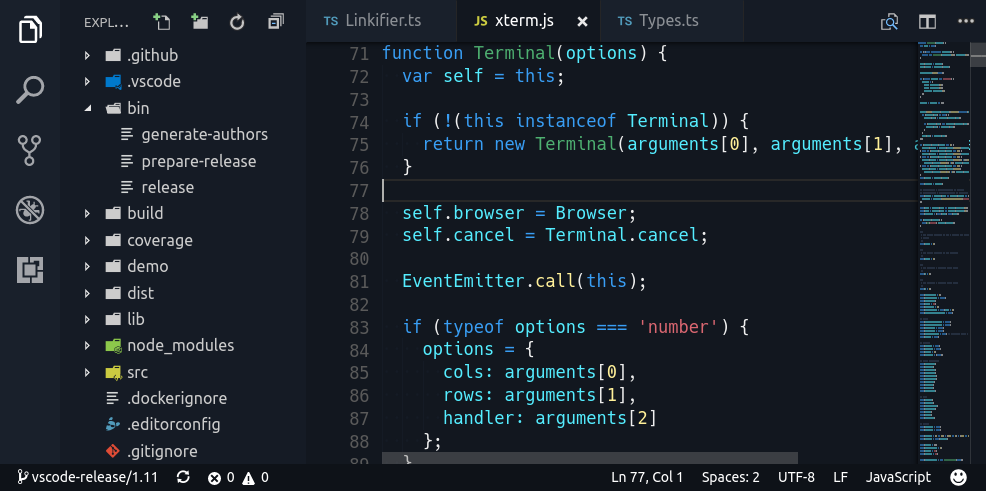

# vscode-theme-generator

⚠️ **This is a preview that leverages the [upcoming VS Code theming options](https://github.com/Microsoft/vscode/issues/3112)** ⚠️<br>
⚠️ **You will need to regenerate your theme when VS Code 1.12 is released and the API finalized** ⚠️

**The Problem**

- New themes are typically forked from other themes, carrying the bugs with them
- .tmThemes are overly verbose and difficult to maintain
- Themes are difficult to write from scratch

**The Solution**

What if all you needed to do to generate a theme was specify a few colors and everything else was handled for you? Well that's what this module aims to accomplish. All you need to do is specify a set of "base colors" (background, foreground and 4 accent colors) and you have a reasonably good looking theme.

All other VS Code theme colors are then derived from those base colors, with the option to tweak each underlying color as well.

## Example

This is all that's needed to generate a great looking theme:

```ts
import { generateTheme, IColorSet } from 'vscode-theme-generator';
const colorSet: IColorSet = {
  base: {
    background: '#12171F',
    foreground: '#EFEFEF',
    color1: '#399EF4',
    color2: '#DA6771',
    color3: '#4EB071',
    color4: '#FFF099',
  }
};
generateTheme('My Theme', colorSet, path.join(__dirname, 'theme.json'));
```



## Getting started

There's a [quick start repository](https://github.com/Tyriar/vscode-theme-generator-quick-start) that allows you to get started quickly, just clone and run!

```bash
git clone https://github.com/Tyriar/vscode-theme-generator-quick-start
cd vscode-theme-generator-quick-start
npm install
```

Make your changes to the colors in index.ts and hit F5 to build the theme and launch the a new VS Code window with your theme available in the command palette (`ctrl`/`cmd+shift+p` > "Color Theme").

## Support

Support below means that the standard VS Code grammar has explicit support for the languages, ie. the colors should match their meanings. Other languages will probably still look alright but there is no guarentee that they will.

- :white_check_mark: C#
- :white_check_mark: CSS
- :white_check_mark: HTML
- :white_check_mark: Java
- :white_check_mark: JavaScript
- :white_check_mark: Markdown
- :white_check_mark: TypeScript

## Roadmap

Below are several of the bigger planned items, community feedback is welcome :smiley:

- Support light themes [#22](https://github.com/Tyriar/vscode-theme-generator/issues/22)
- Allow styling of text style [#16](https://github.com/Tyriar/vscode-theme-generator/issues/16)
- Finalize and commit to API [#28](https://github.com/Tyriar/vscode-theme-generator/issues/28)
- Implement syntax color fallbacks [#27](https://github.com/Tyriar/vscode-theme-generator/issues/27)
- Refine background fallback values [#29](https://github.com/Tyriar/vscode-theme-generator/issues/29)
- Add API documentation [#30](https://github.com/Tyriar/vscode-theme-generator/issues/30)

## Development

```bash
npm run dev
```

Then in VS Code press <kbd>F5</kbd> to build demo and launch the debugger with the generated themes available to switch to.
